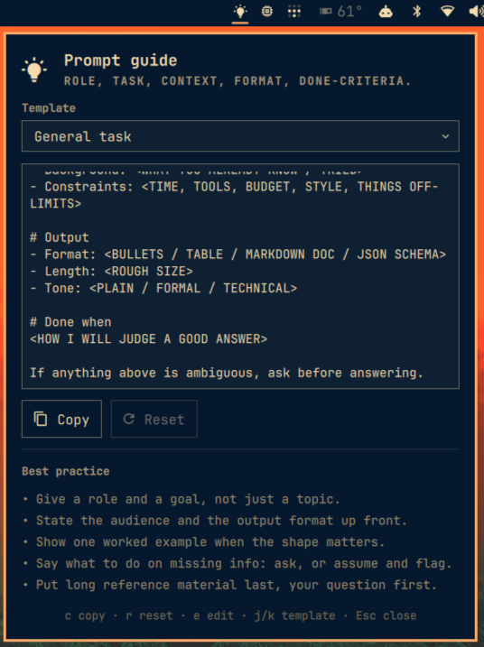

# Prompt guide

An [Omarchy](https://omarchy.org/) shell plugin. A bar icon opens a panel of
best-practice prompt skeletons — pick a template, edit it in place, copy it.

Your edits are saved per template and survive closing the panel, restarting the
shell, and rebooting. **Reset** puts the shipped template back.



## Templates

| Template | For |
|---|---|
| General task | Anything: role, task, context, output, done-criteria |
| Code & debugging | Symptom vs expected, repro, environment, what you tried |
| Writing & editing | Audience, purpose, voice, length, what must not change |
| Research & synthesis | A question with scope, sources, and uncertainty handling |
| Data analysis | Data shape, question, method, and how to handle gaps |

`ALL-CAPS <SLOTS>` are the parts you replace. Everything else is scaffolding
worth keeping.

## Requirements

- **Omarchy 4.x**, which ships the Quickshell-based `omarchy-shell`.
- **`wl-clipboard`** — the copy action pipes through `wl-copy`. It is included in
  `omarchy-base.packages`, so it is already present on every Omarchy install.

No other external dependencies, no network access, no elevated privileges.

## Install

```bash
omarchy plugin add https://github.com/ollywarren/prompt-guide.git --enable --yes
omarchy restart shell
```

Or by hand:

```bash
git clone https://github.com/ollywarren/prompt-guide.git \
  ~/.config/omarchy/plugins/ollywarren.prompt-guide
omarchy-shell shell rescanPlugins
omarchy plugin enable ollywarren.prompt-guide right
```

## Removal

```bash
omarchy plugin remove ollywarren.prompt-guide
```

This asks for confirmation, takes the widget out of your bar, and deletes the
plugin directory. Your saved drafts are deliberately left behind, so
reinstalling picks them back up — delete them yourself if you don't want that:

```bash
rm ~/.local/state/omarchy/prompt-guide.json
```

## Using it

**Mouse** — left click opens the panel · right click copies the current prompt
without opening anything · middle click moves to the next template · scroll
cycles templates.

The three that work with the panel shut confirm themselves with a desktop
notification (*"Code & debugging — Template copied to clipboard"*), since
nothing on screen would otherwise change. Scrolling through several templates
notifies once, for where you land. With the panel open they stay quiet — the
panel already shows the result.

**Keyboard**, once the panel is open:

| Key | Does |
|---|---|
| `c` | Copy the prompt |
| `r` | Reset to the shipped template |
| `e` / `Enter` | Edit (caret goes to the end) |
| `j` / `k` / arrows | Previous / next template |
| `Esc` | Leave the editor; again to close the panel |
| `Ctrl+Enter` | Copy, while editing |
| `Tab` | Move to the neighbouring bar panel |

Bind the panel to a key in `~/.config/hypr/bindings.lua`:

```lua
o.bind("SUPER CTRL", "P", "Prompt guide", "omarchy-shell ollywarren.prompt-guide toggle")
```

## IPC

```bash
omarchy-shell ollywarren.prompt-guide toggle      # open / close the panel
omarchy-shell ollywarren.prompt-guide copy        # copy the current prompt
omarchy-shell ollywarren.prompt-guide prompt      # print it instead
omarchy-shell ollywarren.prompt-guide current     # id of the selected template
omarchy-shell ollywarren.prompt-guide select code # switch template
omarchy-shell ollywarren.prompt-guide next        # or: previous
omarchy-shell ollywarren.prompt-guide reset       # discard edits to this template
```

`copy` works whether or not the panel is open, so a keybind can put the prompt on
the clipboard without any UI.

## What it writes

The plugin writes exactly two things, both on your instruction:

- `~/.local/state/omarchy/prompt-guide.json` — its own state file, holding your
  drafts and the last selected template. This is the only file it ever writes.
- The clipboard, via `wl-copy`, and only when you copy.

**It never modifies your Omarchy or Hyprland configuration.** It does not touch
`~/.config/omarchy/shell.json`; the bar entry there is created and removed by
`omarchy plugin enable` / `disable`, which are your own commands. It spawns no
process other than `wl-copy`.

## Settings

Settings live inline on the layout entry in `~/.config/omarchy/shell.json`, which
hot-reloads on save:

```json
{ "id": "ollywarren.prompt-guide", "panelWidth": 520, "showTips": false }
```

| Key | Default | What |
|---|---|---|
| `icon` | `󰛨` | Bar glyph |
| `panelWidth` | `420` | Panel width in px |
| `editorHeight` | `200` | Prompt box height in px |
| `showTips` | `true` | Show the best-practice checklist |

Or from the shell:
`omarchy bar set ollywarren.prompt-guide panelWidth 520`.

## Customising the templates

The templates are plain data in [`Templates.js`](Templates.js) — `id`, `label`,
`hint`, `body`, `tips`. Add or rewrite them there.

Drafts are keyed by template `id`, so renaming an id orphans its draft rather
than corrupting it. If you rewrite a `body`, any template you have already edited
keeps showing your draft until you hit **Reset**.

## Development

Saving a file under `~/.config/omarchy/plugins/` normally hot-reloads it. If a
change to `Panel.qml` doesn't appear, `omarchy restart shell` — a stale bar widget
is not always caught by `rescanPlugins` alone. Check the manifest with
`omarchy plugin validate <dir>`, and watch for QML errors with
`journalctl --user -f | grep omarchy-shell`.

| File | What |
|---|---|
| `manifest.json` | Plugin declaration and settings schema |
| `Panel.qml` | Bar button + popup |
| `Templates.js` | The templates and their checklists |

## Licence

MIT — see [LICENSE](LICENSE).
